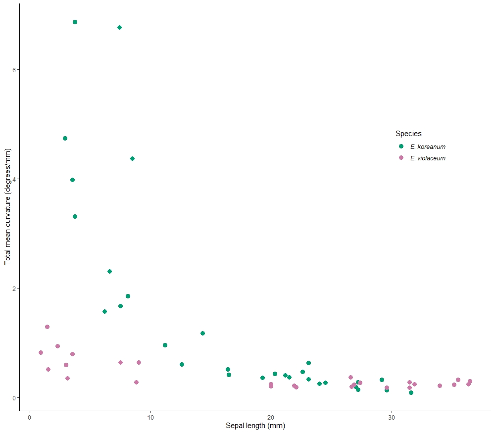
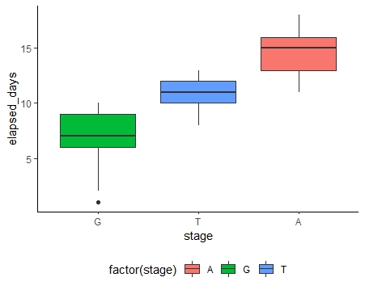
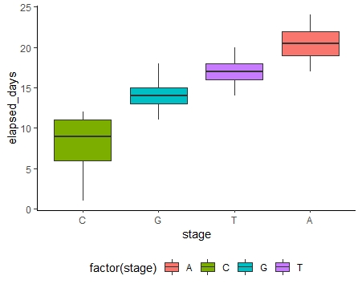
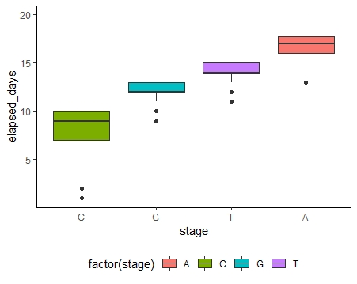
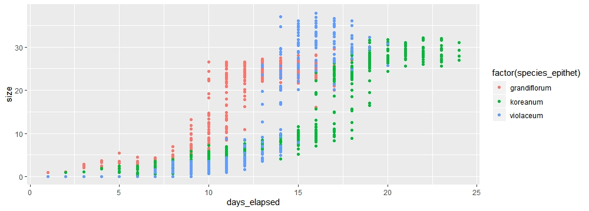
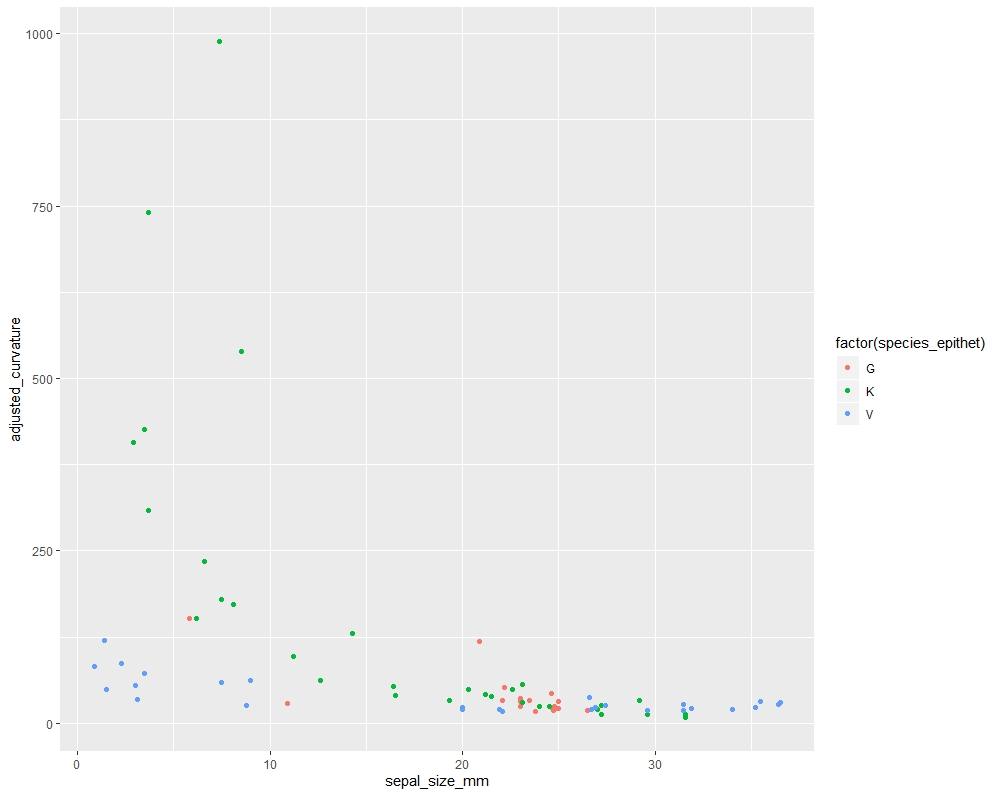
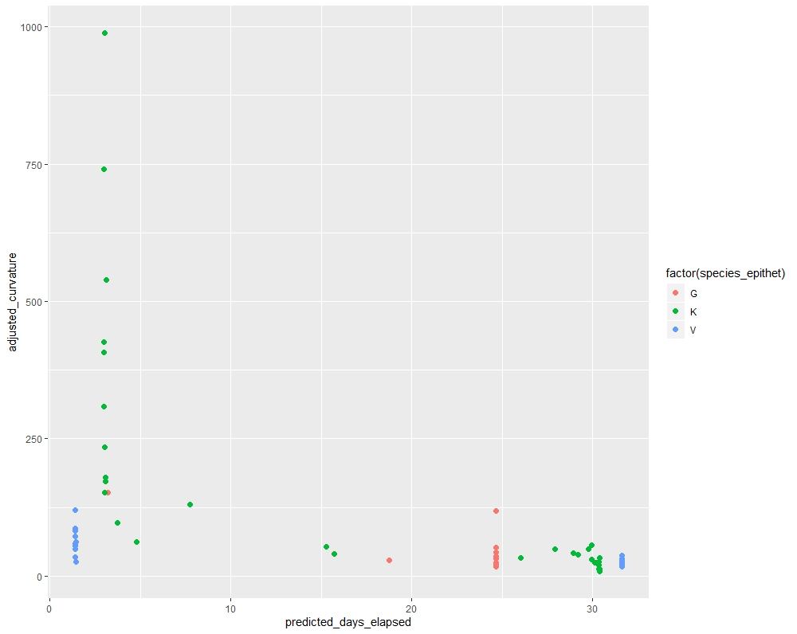
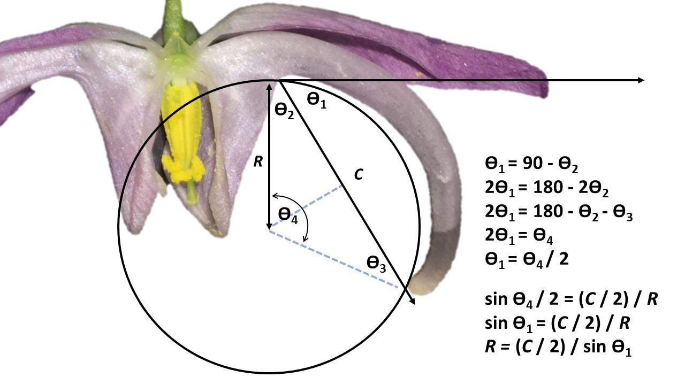

#### Abstract

The curvature of a flower along the lateral plane (‘floral curvature’) is a widespread, convergent trait with important ecological and evolutionary implications. This review summarizes the methods used to measure floral curvature, suggests a clarification of the definition of curvature and a translation into a field-portable methodology. Intuitively, curvature is the degree to which a line is not straight. In plane geometry curvature is defined as the rate at which the unit derivative changes direction with respect to arc length. To apply this definition we suggest a protocol wherein a line is regressed against landmarks placed on a lateral image of an organism, then computing curvature at many points along the fitted line and taking the sum. The utility of this metric was tested by studying the development of nectar spur curvature in _Epimedium_ (Berberidaceae). We found _Epimedium koreanum_ to have an order of magnitude greater curvature than the closely related _E. grandiflorum_ and _E. violaceum_. The suite of functions used to quantify floral curvature in this study are available as an open-source R package ‘curvy’.  The major advantages of this method are 1) precision of measurement is increased without introducing expensive field equipment or computing power, 2) precision of terminology within pollination ecology is improved by adopting from the existing mathematical tools for studying line-curves, and 3)  the opportunity is opened for investigating the genetic basis of (lateral plane) curvature measured at the cellular scale (not sure if this is worth commenting on.. cut if manuscript is too long?)

#### 1. The ecology of floral curvature

> “We are beginning to understand why some hummingbird bills are long, whereas others are short, and why some hummingbird flowers are wide, whereas others are narrow. Now, why are bills of some hummingbirds and the tubes of the flowers they visit curved?” – @temeles_1996.

<br><br>

At the center of plant-pollinator diversification is a remarkable variety of floral form.  The notion that plant communities are under selection to reduce interspecific mating ['floral isolation', @grant_1949], points to the importance of floral diversity in initiating and reinforcing reproductive isolation [@armbruster_2009]. For example, in the rapid radiation of Andean _Centropogon_ (Campanulaceae), competition for pollination led to the divergence of floral traits associated with bat and hummingbird pollination [@lagomarsino_2019]. Meanwhile, in South African _Lapeirousia_ (Iridaceae), geographic variation in floral tube length has initiated reproductive isolation between morphs with short and long flower tubes, despite sharing the same fly pollinator [@minnaar_2019]. Thus, floral morphology is a key phenotypic feature underlying the diversification of plants and pollinators [@kay_2009; @ollerton_2017]. 

Flower-pollinator curvature as viewed from the side (lateral plane), has been a trait of special interest since the post-Darwin era of pollination ecology. In making pollinator observations of the Cape flora, Scott-Elliott [-@scott-elliot_1890] noticed that the flowers of _Leonotis ocymifolia_ (Lamiaceae) visited by _Nectarinia_ sunbirds were "curved with the same curvature as that of the bird's beak." (p. 272). Robertson [-@robertson_1889] insightfully notes that the curved nectar spurs of _Viola_ spp. (Violaceae) "serves to limit the insect visits much more than the mere length of the spur." (p. 172). From these early observations curvature has been synonymous with specialization; we expect curvature to limit the range of functional taxa in a plant-pollinator mutualism and strengthen interactions between the existing participants. And these expectations have largely been supported: Stiles [-@stiles_1975] first posited that neotropical _Heliconia_ partition hummingbird visitation by flower-bill curvature, and that specialization by curve-billed hummingbirds allow co-existence within the species-rich _Heliconia_ clade.  Subsequent research supports this hypothesis [@maglianesi_2014]:  along the slopes of the Central Cordillera (Costa Rica), the degree of flower-hummingbird bill curvature is proportional to plant-pollinator interaction strength [@dehling_2014] and extent of specialization (_d'_, [@bluthgen_2006]. More recently the scope of plant-pollinator research has expanded to address the biogeography of curvature. As predicted by Stiles [-@stiles_2004], Maglianesi [-@maglianesi_2015] and Sonne [-@sonne_2019] find curvature to be most prevalent in the lowland environments of the neotropics. Explanations for this pattern range from heightened competition at lower elevations to environmental filtering in the Andean highlands [@stiles_2004; @graham_2009]. Because the neotropical hummingbird subfamily Phaethornithinae comprises the majority of species with curved bills, we might expect plant-hummingbird curvature to have a predictable global distribution. 

Pollinator specialization has major effects on macroevolutionary and biogeographic patterns [@kay_2009; @armbruster_2009; @vamosi_2018], and curvature is a component, but widespread feature of specialist systems. Therefore,  to synthesize our knowledge of curved plant-pollinator systems, curvature is a concept that needs an exact definition and method of measurement. In this review we summarize the approaches to measuring curvature within the field of plant-hummingbird pollination, identify strengths and shortcomings, and offer a solution with the aim of standardizing how curvature is studied within the field of pollination ecology. Although this review is motivated by the problem of measuring curvature in plant-hummingbird systems, the solution is general to any biological form modelled as a line curve: this case is hopefully made in the demonstration to follow. 

#### 2. Summary of the literature 

We searched the scientific literature for studies focusing on or considering floral curvature - a common measurement used in pollination ecology as a proxy for specialization. We make the distinction between measuring curvature in the lateral plane versus measuring curvature of surfaces (e.g. of petals). The methods for handling surface (Gaussian) curvature are relatively developed and well-defined [@nath_2003; @coen_2016]. The literature was sourced by querying Google Scholar for the terms "corolla curvature", "flower curvature", and "hummingbird curvature".  Results are summarized in Table 1. 25 studies of hummingbird-plant systems were found using some form of curvature metric (Table 1).  An additional 10 studies of other plant, insect, and passerine bird systems were found (Table S1). There were numerous studies of plant-pollinator shape that did not address curvature - these were omitted. 

The discussion of lateral curvature in plant-hummingbird interactions begins with Hainsworth [-@hainsworth_1973] and is first empirically studied by Stiles [-@stiles_1975], though methods for measuring curvature of bird bills outside of a pollination context can be found much earlier [@baldwin_1931]. We identified six common approaches to measuring curvature. First, there are qualitative descriptions, e.g. "very curved", "less curved", but these have generally been out of use since the 1970s. Second, the _arc:chord_ method wherein curvature is a ratio of two lines: a straight line (chord) from tip to base (of the flower or bill) and a line that traverses a path along the arc of the flower/bill ([Figure 1](Figures/Figure_1.jpg)). Third, the _orthogonal length_ method which defines curvature as a ratio of two lines: a straight line from base to tip and a perpendicular line that measures the width of the flower/bill. This method is another form of the _arc:chord_ method because for a given chord length, the length of the perpendicular line will be proportional to the arc length.  Fourth, the _angle of deflection_ method which considers curvature as the angle between the base of the flower/bill and its tip. This is another form of the _inverse radius_ method which approximates the entire length of the flower/bill as a segment of a circle. These methods are interchangeable because the radius of a circle can be calculated from the length and angle of a line that passes through it [@bell_1956; @temeles_2009], see: [Figure S1](Figures/Figure_S1.jpg).  Sixth, geometric morphometrics, which quantifies shape as a configuration of homologous points (landmarks) existing on a coordinate plane ([Figure 2](Figures/Figure_2.jpg)). 

The strength of methods 2 and 3 are their portability and accessibility. These measurements can be taken in the field, or soon after from photographs. The methods are intuitive and in the simplest case, require only a ruler, string, and protractor. However, even if the measurements are made using imaging software these methods have some shortcomings [discussed in @berns_2010], principally that there are many shapes that could produce the same curvature value. For the _inverse radius_ method, a curve is approximated with the segment of a circle. This method is insufficient for any flower and bill shapes that deviate from having constant curvature (_e.g._ nectar spurs of _Delphinium_ ). Similarly, the _angle of deflection_ is not sensitive to local features along the length of the flower/bill - only the start and end points are considered in the calculation.  


Starting in 2010, geometric morphometrics (GM) emerges in the pollination literature. GM has since steadily gained in popularity in this field due to its statistical rigour, reproducibility, and the intuitive visual results presented as transformations of shape (_e.g._ illustrations of geographic variation in flower shape @gomez_2009). We briefly outline the reasoning of a GM protocol to introduce relevant concepts, but recommend the authoritative introduction to the topic written by Webster and Sheets [-@webster_2010]. A GM protocol for a 2-D object begins by placing the specimens on an _xy_ grid and assigning landmarks to locations on the specimen that are topologically or biologically homologous - a landmark is defined so that its location can be reproduced within and between samples. The set of landmarks representing the shape of an organism is a 'landmark configuration'.  In a comparative study, the samples must first be optimally aligned and their shape information isolated from their orientation, location, and size. This is done using a least-squares type protocol, most commonly the Generalized Procrustes Analysis (GPA). GPA-adjusted landmark configurations hereafter exist in a multidimensional shape space defined by the number of landmarks and spatial dimensions implemented. Each landmark configuration contains unique information about the specimen's shape, and as such, occupies a unique position in the corresponding shape space.  These configurations are then "projected" onto a simpler Euclidian space, similar to the reduction of a spherical Earth onto a two-dimensional map [@webster_2010]. From here, familiar statistical procedures (_e.g._ PCA) can be performed to quantify variation in landmark configurations (shape) between samples. 

This is giant leap forward for morphological studies because GM is a complete protocol for measuring, quantifying, and comparing shapes with high precision, as well as the covariation of these shapes with ecological variables of interest. The limitation of GM in quantifying curvature is that this method is concerned with analyzing configurations of landmarks, _i.e._ the entirety of a shape summarized as a set of _xy_ coordinates.  Once the specimen has been reduced to a landmark configuration, it exists as a point in shape space. Parsing segments of landmark configurations for separate analyses (_e.g._ for curvature) is not currently part of the geometric morphometrics toolkit. Therefore, studies that have used this technique to analyse biological forms are able to compare shapes in their entirety, but are ultimately limited to making descriptive statements about how segments of shapes appear to have different curvatures [_e.g._ @berns_2013, pp. 251]. 

#### 3. What is curvature?

Reviewing the literature leads us to ask, “what is curvature?”. There exists several distinct but related definitions, resulting from a history of independent mathematical derivations [reviewed in @coolidge_1952; @bardini_2016]. Here, we follow the conventions of @casey_1996 and @rutter_2000. In a two-dimensional, flat (Euclidian) space [@heath_1956], a straight line is traced when a particle moves without changing direction.  A curve is traced when a particle moves from its origin and does not maintain its original heading as it moves. At every step along its path, the particle has a measure of direction and speed. The degree to which the direction of a particle changes from one position to the next is its curvature ([Figure 3](Figures/Figure_3.jpg)). Intuitively, a particle that traces a straight line will not change its direction and will have zero curvature. A particle that traces a turning line will have relatively greater curvature.  

In order to formalize this concept of curvature, we first introduce the concept of a vector-valued function. Physically, a vector can be thought of as an arrow-like object with length and direction [Figure 4](Figures/Figure_4.jpg). A vector that exists in a coordinate plane "points" to an $(x, y)$ location and is called a _position vector_.  The $x$ and $y$ components of a position vector can be handled separately as scaled _unit vectors_ of length 1.  Therefore, the length of a position vector is computed as the Euclidian distance (hypotenuse) between its rectangular $x$ and $y$  unit vector components (Figure 4). A vector's direction is determined by its relative orientation to an arbitrarily chosen fixed line (_e.g._ the $x$-axis). Because vectors can "point" to a location on a coordinate plane, an $(x, y)$ coordinate can 
can be rewritten as a position vector <center> $\mathbf{r} = x\mathbf{i} + y\mathbf{j}$,  </center> 

Where $\mathbf{i}$  and $\mathbf{j}$ are orthogonal unit vectors fixed on the $x$ and $y$ axes, respectively, and $\mathbf{r}$ is the resultant position vector pointing to some point $(x, y)$ ([Figure 4](Figures/Figure_4.jpg)).  

Now, instead of the typical $f(x) = y$ notation for a function, consider a curve as the path traced by a moving particle that passes through a set of $(x, y)$ points, described by two time-dependent functions <center> $x = \hat{x}(t)$, <br> $y = \hat{y}(t)$, </center>

where $\hat{x}$ and $\hat{y}$ denote that $x$ and $y$ are functions of time $t$.  This parameterization is convenient because we would like to treat position vectors as composites of the unit vectors $\mathbf{i}$ and $\mathbf{j}$.  Consequently, we can combine the concepts of eqs 1 and 2 to produce a _vector-valued function_  <center> $\mathbf{\hat{r}}(t) = \hat{x}(t)\mathbf{i} + \hat{y}(t)\mathbf{j}$ ,  </center> 

where $\mathbf{\hat{r}}(t)$ is a function that produces a position vector $\mathbf{r} = x\mathbf{i} + y\mathbf{j}$ determined by $t$. 

Extending this concept, if we have general curve with an arc length $s$, this curve can also be paramtertized its arc length, instead of time <center> $\mathbf{\bar{r}}(s) = \bar{x}(s)\mathbf{i} + \bar{y}(s)\mathbf{j}$ . </center> 

Where $\mathbf{\bar{r}}(s)$ indicates that the position vector $\mathbf{r}$ is determined by its arc length $s$. 
When a curve is parameterized by its arc length, for every increment of $s$ that we move along the curve ($ds$), we generate a position vector $\mathbf{r}$ indicating our $(x, y)$ location in the coordinate plane. 

If we are interested in the derivative properties of a vector-valued function, we can differentiate a position vector $\mathbf{{r}}$ with respect to arc length $s$ as <center> $\frac{d\mathbf{{r}}}{ds} = \lim\limits_{\Delta s \to 0} \frac{\Delta\mathbf{r}}{\Delta s} = \mathbf{T}$ . </center>

The resultant tangent vector $\mathbf{T}$  not only indicates the direction of the curve at position ${\mathbf{r}(s)}$ but also has a length of 1. This is because as ${\Delta s \to 0}$, the length of the tangent vector ($d\mathbf{r}$) and the length of the arc segment ($ds$) become equal. In this case, the tangent vector is called the _unit tangent vector_. 

At the beginning of this section we defined curvature ($K$) as the degree to which the direction of a particle changes from one position to the next. More formally this could be stated as _the degree to which the direction of the unit tangent vector changes with respect to arc length_. By "degree" we mean the angle $\phi$ formed between the tangent vector and the $x$-axis or some other arbitrary reference ([Figure 4](Figure_4.jpg)). <center>$K = \frac{d\phi}{ds}$. </center> 


 
#### 4. A proposed protocol for measuring curvature

In order to apply the above definition of curvature, a biological organ or tissue needs to be reduced to a continuous function.  We propose a workflow as illustrated in [Figure 3](Figures/Figure_3.jpg). Cosgrove [-@cosgrove_1990] uses an analogous approach to study the development of cucumber hypocotyls. By fitting cubic splines to hand-marked seedlings, curvature was computed using the same definition as above.  Since Cosgrove [-@cosgrove_1990], the entire field of landmark-based geometric morphometrics has unfolded [reviewed in @adams_2013]. This rigorous, reproducible toolkit has been used extensively in pollination ecology, but has not yet been leveraged to calculate curvature ([Table 1](Tables/Table_1.csv)).  Terral et al [-@terral_2004] use these tools to digitally landmark olive stones and fit polynomials to the landmarks: synthesizing the concepts of Cosgrove [-@cosgrove_1990] and Terral [-@terral_2004] produces a modernized method for fitting curves and computing curvature from biological forms (Figure 3) 


Comment on why using the simplest case (polynomials) and not splines, fourier, etc. 

#### 5. Proof of concept: A study of the development of curvature in _Epimedium_

We tested the utility of this curvature metric by studying floral development in _Epimedium grandiflorum_ C.Morren, _Epimedium koreanum_ Nakai, and _Epimedium violaceum_ C.Morren. (Berberidaceae, Table 2 - sample sizes). The latter two 'species' are generally considered forms of _E. grandiflorum sensu lato_ [@stearn_2002], but we considered them separate for comparitive purposes.

Flower size was measured daily from April 9 to May 2, 2019 at the UBC Botanical Garden (Supp Mat 1). Size was defined as the length between the apex of the two outer sepals lying on the major axis of the flower - aestivation is imbricate. Length was measured to the nearest 0.1 mm using an SPI Polymid Dial Caliper. By correlating changes in flower size to developmental landmarks (Figure 5), we were able to define 3 discrete stages of flower development in _E. grandiflorum_ and 4 stages in _E. koreanum_ and _E. violaceum_ (Table 3, & will include figure with photographs of the stages). 

Flowering stage data was fragmented and staggered because of censoring, i.e. due to tracking flowers after their initial budding stage, or flowers that had succumb to herbivory or weather after several days of measurement. Therefore, stage data was aligned by using a multiple sequence alignment protocol (ClustalW implemented in ```msa``` v.3.9) with a neutral (identity) substitution matrix.  Gap opening was prohibited. By aligning phenological data within species, a consensus stage sequence was calculated and used to estimate flower age where observations were censored. Once aligned, these data represent the 'developmental dataset'.

To measure curvature, a separate set of flowers were sampled haphazardly and preserved in 70% ethanol. Preserved flowers were later transferred to a glass slide and imaged in the lateral view using a stereo microscope at 0.63x (Zeiss Stemi 508 with Axiocam 301). Specimens that did not fit within the field of view were imaged in halves and the images joined using the Stitching Plugin in the Fiji distribution of ImageJ2 [@preibisch_2009; @rueden_2017].

Photographed specimens were landmarked digitally using tpsDig [@rohlf_2015]. We placed landmarks along the edge of dorsal petals (in lateral view) as an approximation of the flower's total shape (see discussion of geometric morphometrics above).  Landmarks used to measure the dorsal arc were 1) the farthest point on the apex of the spur before the inflection point where either the spur diminishes to a tip (_E. violaceum_) or widens into a saccate reservoir (_E. koreanum_), and 2) the inflection point at which the spur widens to become an attachment for the petal to the stem (anatomical name?). 13 semi-landmarks [defined in @webster_2010] were placed between landmarks 1 and 2 (illustrated in Figure S2).

Landmark files (.tps) were imported into R using  ```Momocs```  v.1.3.0 [@bonhomme_2014]. Polynomial functions were regressed to the landmark coordinates for each specimen using ```Momocs``` - we chose polynomials of the third degree based on the recommendations of @rohlf_1990. Arc length was calculated from bounded polynomial functions using  ```pracma``` v.2.2.5 [@borchers_2019]. Curvature, as defined in the previous section, was computed using a custom function modified from the ```maxcurv()``` function of the ```soilphysics``` package v.3.1 [@silva_2017]. All custom functions used in this analysis are available as an R package ```curvy``` hosted at github.com/mannfred/curvy. R scripts used in this analysis are hosted at github.com/mannfred/epidmedium. These data represent the 'curvature dataset'.

Because the second set of flowers were sampled opportunistically after the developmental study, age was inferred by outer sepal size. First, the developmental data was used to model size and age as a logistic function using the ```drc`` v.3.0.1 package in R [@ritz_2015]. Then, age was inferred for the curvature data by inputing size information into the logistic model. 

Results: 


In _E. grandiflorum_ we identified three distinct stages of development (Tukey's HSD: p<0.01). The first stage ("G") is defined as the initiation and growth of the bud until the petals begin to separate ("T" stage). At the "T" stage nectar begins accumilating in the spurs. Anthesis takes place during the "A" stage at which point the flower opening may increase in size and anthers dehisce. In _E. koreanum_ and _E. violaceum_ we detected another distinct "C" stage in the early stage of bud development. At this stage the petals are shorter in length than the sepals that envelop them - the "G" stage begins when the petals overtake the surrounding sepals in length. 

-insert Table 4 with mean +/- 95%CI of sizes (mm) for all three species.















_E. koreanum_ is more curved at initial stages of development:




_E. koreanum_ is more curved at initial stages of development:



<!-- Developmental stages within species -->
<!-- E. grandiflorum: E and G stages are not different. But E and G are different from O and subsequent stages. O is distinct from G-E and P-D-A. P,D,A are the same. So, real stages are E-G, O, P-D-A.  E. koreaum: E, G, O are distinct. P, D, A are the same. Real stages are E, G, O, P-D-A. E. violaceum: same as koreanum. -->

<!-- _Developmental stages between species_ -->

<!-- **E stage**: violaceum-grandiflorum and violaceum-koreanum are different. koreanum-grandiflorum  are the same size. -->
<!-- **G stage**: koreanum-grandiflorum and violaceum-koreanum are different, violaceum-grandiflorum are the same size. -->
<!-- **O stage**: violaceum-grandiflorum are different sizes.  -->
<!-- **P-D-A stages**: all 3 spp are different -->


<!-- Discussion: The definition of curvature used in section 3 underlies the concept of curvature used by physiologists studying structural morphology. For example, @bastien_2014 use this definition of curvature to study plant growth in relation to gravity (graviception). In this context, curvature is discussed as the rate of change of the angle of a material element (i.e. a cell) with respect to its position (s). This points to perhaps the greatest advantage to defining curvature as a local property that can be integrated across a flower or bill. Because the macroscopic shape of a flower or pollinator has a genetic basis, the evolutionary ecologist might now consider the molecular mechanisms underlying their favourite organism with lateral curvature - as has been done with curved surfaces [@coen_2016].  -->

\newline

```{r include=FALSE} 
knitr::opts_chunk$set(echo=FALSE, warning=FALSE, message=FALSE)
```

\newline

```{r table1}
library(here)
table1<-read.csv(here('data/Table_1_review_lit_curvature.csv'), header=TRUE)
knitr::kable(table1, caption = 'Table 1: Summary of literature reviewed for the role of curvature in plant-pollinator systems.')

# table_2<-read.csv(here('data/Table_2_epimedium_flower_stages.csv', header=TRUE))
# knitr::kable(table_2, caption = 'Table 2. Description of flower stages for Epimedium.')

```

<br><br>


```{r table5}
library(here)
table3<-read.csv(here('data/Table_5_elapsed_days_per_stage.csv'), header=TRUE)
knitr::kable(table3, caption = 'Table 3: Elapsed days per stage for three Epimedium species.')
```


<br><br>

```{r tableS1}
library(here)
tableS1<-read.csv(here('data/Table_S1_additional_curvature_studies.csv'), header=TRUE)
knitr::kable(tableS1, caption = 'Table S1: Additional studies of curvature outside of hummingbird pollination')
```

<br><br>



\newline

\newline

# References 

\setlength{\parindent}{-0.2in}
\setlength{\leftskip}{0.2in}
\setlength{\parskip}{8pt}
\noindent


