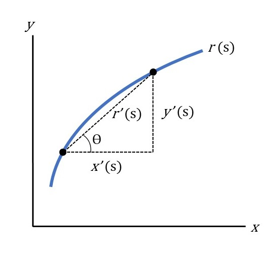

#### For a curve parameterized by arc-length:

&nbsp;

Let $r(s) = (x(s), y(s))$ be a curve parameterized by arc-length ($s$), where $s$ determines the position $(x(s), y(s))$ on the curve $r$. &nbsp;

Also let $x(s)$ and $y(s)$ be differentiable so that $\sqrt{x'(s)^2 + y'(s)^2} = r'(s) = 1$.

{width=50%}

&nbsp;

The slope of $r'(s)$ is $\frac{y'(s)}{x'(s)}$. 

The angle, $\phi$, of $r'(s)$ is then $arctan(\frac{y'(s)}{x'(s)})$.

Curvature, $\kappa$, is then $\frac{d\phi}{ds}$

